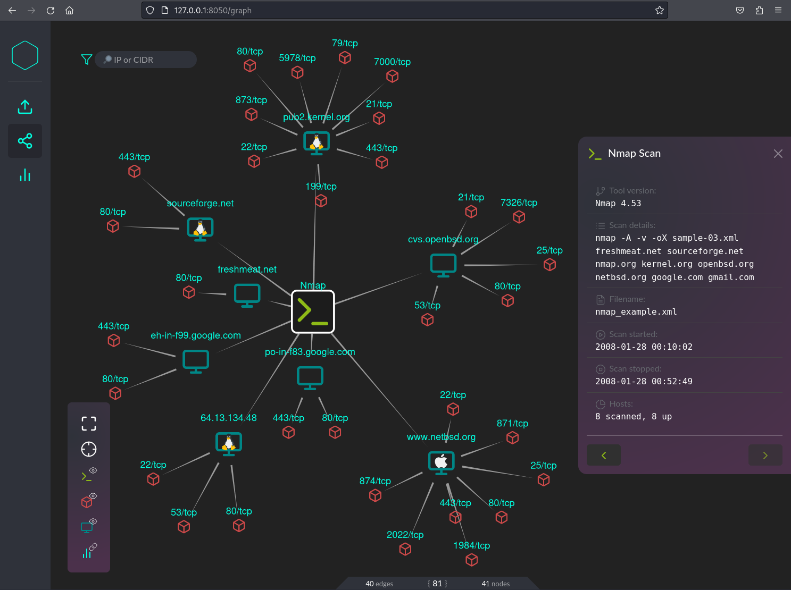
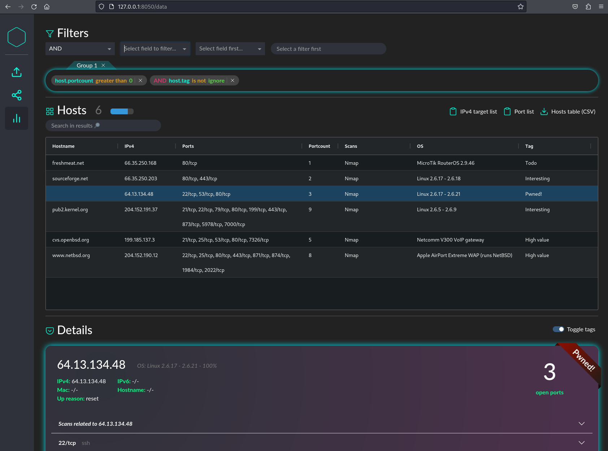
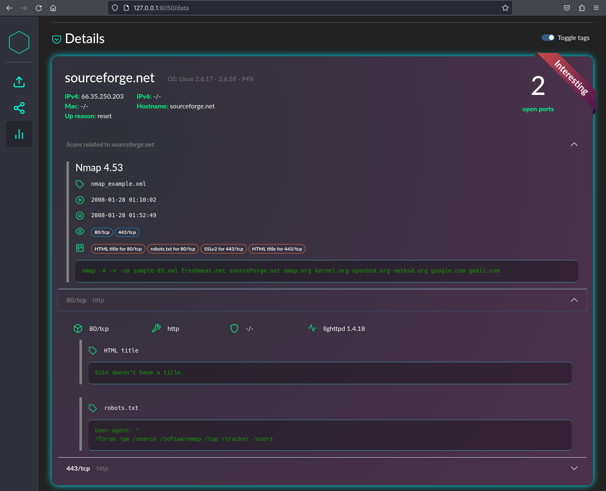

# scandeavour

Dashboard for merging, visualising and filtering network scans.

## Setup

Requires Python 3.12+.

```Bash
git clone https://github.com/Cr4ckC4t/scandeavour.git
cd scandeavour
python3 -m venv ./venv
# On Linux
./venv/bin/pip3 install -r requirements.txt
./venv/bin/python3 app.py my_project.db
# On Windows
.\venv\Scripts\pip3 install -r requirements.txt
.\venv\Scripts\python3 app.py my_project.db
```

## Dashboard










# License and attribution

Code released under the [MIT License](LICENSE).

Built using [Dash](https://github.com/plotly/dash/tree/dev) (licensed under MIT), [Dash Bootstrap Components](https://github.com/facultyai/dash-bootstrap-components) (licensed under Apache 2.0), and [Bootswatch](https://github.com/thomaspark/bootswatch) (licensed under MIT).

